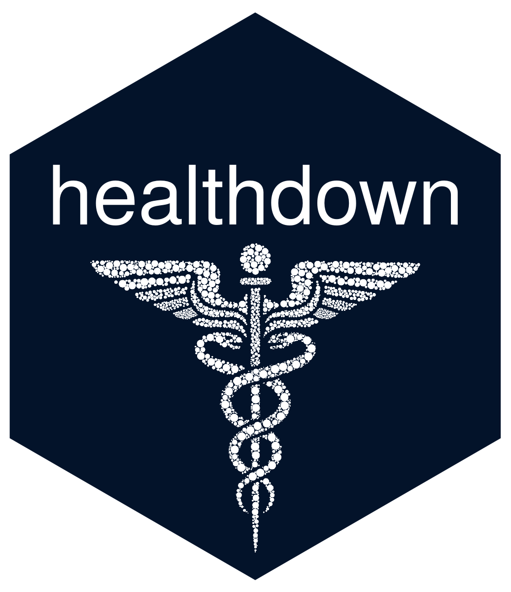

# healthdown </a>
The **Healthdown** app allows interactive comparison of various health factors at the U.S. state and county level.

**Data source**: The annual rankings by the [University of Wisconsin Population Health Institute](https://www.countyhealthrankings.org/) provide an insightful snapshot of how health is affected by various factors.

The app was primarily developed for the [Shiny Contest 2021](https://blog.rstudio.com/2021/03/11/time-to-shiny/) to demonstrate the capabilities of the [leafdown package](https://hoga-it.github.io/leafdown/index.html).

Link to healthdown: https://hoga.shinyapps.io/healthdown/.

 

